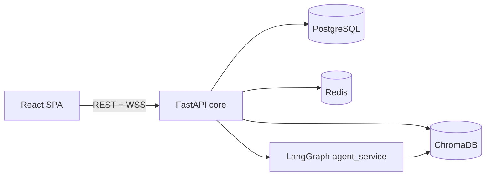

# VirFriendo

Ứng dụng chat **AI companion** giao diện lấy cảm hứng từ **Visual Novel** (layout, thoại dạng narrative, portrait). Backend **FastAPI** + **LangGraph** trong cùng một tiến trình Python; dữ liệu **PostgreSQL**, **Redis**, **ChromaDB** (RAG khi cấu hình).

---

## Tài liệu (đọc theo mục lục)

Toàn bộ tài liệu kỹ thuật nằm trong [`docs/`](./docs/README.md).

| # | File | Nội dung |
|---|------|----------|
| — | [`docs/README.md`](./docs/README.md) | **Mục lục** và gợi ý lộ trình đọc |
| 01 | [`docs/01-architecture.md`](./docs/01-architecture.md) | Kiến trúc, luồng chat UI + backend |
| 02 | [`docs/02-local-development.md`](./docs/02-local-development.md) | Cài đặt local, `.env`, Docker Compose, cổng |
| 03 | [`docs/03-data-and-storage.md`](./docs/03-data-and-storage.md) | PostgreSQL, Redis, ChromaDB |
| 04 | [`docs/04-api-overview.md`](./docs/04-api-overview.md) | REST, `/health`, WebSocket `/chat/ws` |
| 05 | [`docs/05-agent-pipeline.md`](./docs/05-agent-pipeline.md) | LangGraph, intent → node |
| 06 | [`docs/06-roadmap-infra.md`](./docs/06-roadmap-infra.md) | Roadmap hạ tầng |
| 07 | [`docs/07-security-and-secrets.md`](./docs/07-security-and-secrets.md) | JWT, CORS, production |
| 08 | [`docs/08-troubleshooting.md`](./docs/08-troubleshooting.md) | WS, DB, FAQ |

---

## Tính năng (theo code hiện tại)

**Frontend (`frontend/src/pages/Chat.tsx`, components liên quan)**

- **Thoại bot:** Nội dung assistant được **cắt thành các khối ngữ nghĩa** (`splitIntoSemanticBlocks`: đoạn văn, câu gộp theo ngưỡng độ dài và heuristics đổi chủ đề), render **Markdown** qua `ChatMarkdown`. **Không** có hiệu ứng “karaoke từng ký tự” trong bubble chat.
- **Stream:** Ưu tiên **WebSocket** (`stream_start` / token / `stream_end`); khi đang stream, dòng cuối hiển thị **con trỏ nhấp nháy** (`vn-cursor-blink`). Hết stream hoặc fallback **REST** nếu WS không dùng được.
- **Tương tác khối:** Mỗi khối thoại là vùng có thể **click** → mở **popup** đọc nội dung khối đó (không phải cơ chế “next line” kiểu engine VN cổ điển).
- **Cổng vào chat (`ChatEntryGate`):** Có component **tiêu đề câu hỏi** tách từng ký tự với animation stagger (`KaraokeQuestion`) — đây là chỗ **duy nhất** trong UI dùng kiểu “karaoke letter” theo code.
- **Khác:** Sidebar bond (hearts), `avatar_action` đổi style vòng portrait; hub **game** trong chat: Chess, Caro, Tetris, Snake, Ringrealms (RTS nhúng); **diary** qua API khi dùng tab tương ứng.

**Backend (`services/core` + `services/agent_service`)**

- **Auth** + **Chat** (REST + WebSocket `/chat/ws`).
- **LangGraph** (`workflow.py`): `classifier` → `emotion` → một trong các node **`chit_chat`**, **`guardrail`**, **`entertainment_expert`**, **`comfort`**, **`advice`**, **`crisis`** (theo intent map trong `route_intent`).
- **LLM** (`llm/client.py`): mặc định ưu tiên **OpenAI** (`OPENAI_API_KEY`, model mặc định `gpt-4o` nếu không set `OPENAI_MODEL`); có thể chuyển **Groq** qua `LLM_PROVIDER=groq` và `GROQ_API_KEY`. RAG / retrieval nằm trong `agent_service/llm/` (Chroma khi bật).

---

## Kiến trúc (tổng quan)



Chi tiết: [`docs/01-architecture.md`](./docs/01-architecture.md).

---

## Cấu trúc thư mục

```
├── docs/              # Tài liệu kỹ thuật (mục lục: docs/README.md)
├── frontend/          # React + Vite + TypeScript + Tailwind
├── services/
│   ├── core/          # FastAPI — auth, chat, API
│   └── agent_service/ # LangGraph — agents, RAG, LLM
├── shared/
├── migrations/        # Alembic
├── requirements.txt
├── docker-compose.yml # Postgres, Redis, ChromaDB (local)
├── Makefile
└── README.md
```

`scripts/`, `tests/`, `integrations/` có thể local-only — xem [`.gitignore`](./.gitignore).

---

## Yêu cầu môi trường

- Python **3.10+**
- Node.js **18+** (frontend)
- **Docker** + Docker Compose (PostgreSQL, Redis, ChromaDB)

Tạo file **`.env`** ở thư mục gốc (không commit; không có template trong repo). Chi tiết: [`docs/02-local-development.md`](./docs/02-local-development.md) và `services/core/config.py`.

---

## Chạy nhanh

### 1. Hạ tầng dữ liệu

```bash
docker compose up -d
```

### 2. Backend

```bash
python -m venv .venv
.venv\Scripts\activate   # Windows
pip install -r requirements.txt
uvicorn services.core.main:app --reload --port 8000
```

### 3. Frontend

```bash
cd frontend
npm install
npm run dev
```

- UI: **http://localhost:5173**
- API: **http://localhost:8000** — OpenAPI `/docs` khi bật (môi trường dev).

**WebSocket:** `ws://localhost:8000/chat/ws?token=...` — trong dev, frontend gọi thẳng API (port 8000), không proxy WS qua Vite — [`docs/04-api-overview.md`](./docs/04-api-overview.md), [`docs/08-troubleshooting.md`](./docs/08-troubleshooting.md).

---

## Roadmap hạ tầng (DevOps)

[`docs/06-roadmap-infra.md`](./docs/06-roadmap-infra.md).

---

## License

MIT (hoặc theo quy định của repo chủ).
