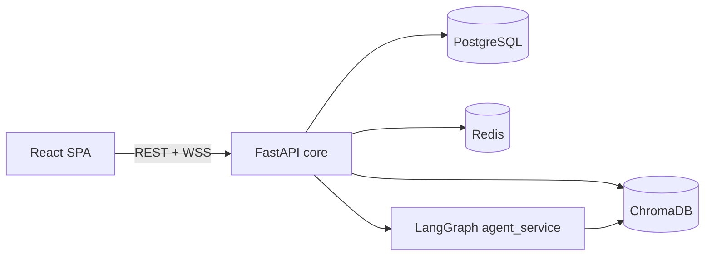

# VirFriendo

Ứng dụng chat **AI companion** phong cách nhân vật anime, giao diện **Visual Novel** (VN): thoại theo chunk, hiệu ứng karaoke, cooldown, skip/advance. Backend **FastAPI** + **LangGraph** (intent, đa agent, RAG), dữ liệu **PostgreSQL**, **Redis**, **ChromaDB**.

---

## Tài liệu (đọc theo mục lục)

Toàn bộ tài liệu kỹ thuật nằm trong [`docs/`](./docs/README.md) — đánh số giống cách tổ chức repo platform (mục lục + từng chủ đề).

| # | File | Nội dung |
|---|------|----------|
| — | [`docs/README.md`](./docs/README.md) | **Mục lục** và gợi ý lộ trình đọc |
| 01 | [`docs/01-architecture.md`](./docs/01-architecture.md) | Kiến trúc, sơ đồ, boundary `core` / `agent_service` |
| 02 | [`docs/02-local-development.md`](./docs/02-local-development.md) | Cài đặt local, `.env`, Docker Compose, cổng |
| 03 | [`docs/03-data-and-storage.md`](./docs/03-data-and-storage.md) | PostgreSQL, Redis, ChromaDB |
| 04 | [`docs/04-api-overview.md`](./docs/04-api-overview.md) | REST, `/health`, WebSocket `/chat/ws` |
| 05 | [`docs/05-agent-pipeline.md`](./docs/05-agent-pipeline.md) | LangGraph, RAG (tổng quan) |
| 06 | [`docs/06-roadmap-infra.md`](./docs/06-roadmap-infra.md) | **Roadmap hạ tầng** (Docker → CI → K8s → cloud) |
| 07 | [`docs/07-security-and-secrets.md`](./docs/07-security-and-secrets.md) | JWT, CORS, production |
| 08 | [`docs/08-troubleshooting.md`](./docs/08-troubleshooting.md) | WS, DB, FAQ |

---

## Tính năng (tóm tắt)

- **Chat kiểu VN:** Hội thoại chunk, karaoke từng chữ, cooldown trước đoạn đầu, click để skip/advance.
- **Backend:** Auth + Chat API (REST + WebSocket), LangGraph với các nhánh agent (ví dụ chit_chat, guardrail, entertainment_expert, comfort, advice, crisis — theo code trong `services/agent_service`).
- **Mở rộng:** RAG giải trí (anime/manga/game/phim), mini-game, mood/diary (theo module đã bật).
- **Vận hành:** Ưu tiên GPT‑4o class + RAG + guardrails; không bắt buộc fine-tune để chạy demo/production nhỏ.

---

## Kiến trúc (tổng quan)



Chi tiết và sơ đồ đầy đủ: [`docs/01-architecture.md`](./docs/01-architecture.md).

---

## Cấu trúc thư mục

```
├── docs/              # Tài liệu kỹ thuật (mục lục: docs/README.md)
├── frontend/          # React + Vite + TypeScript + Tailwind
├── services/
│   ├── core/          # FastAPI — auth, chat, API
│   └── agent_service/ # LangGraph — agents, RAG, LLM
├── shared/
├── migrations/        # Alembic
├── requirements.txt
├── docker-compose.yml # Postgres, Redis, ChromaDB (local)
├── Makefile
└── README.md
```

`scripts/`, `tests/`, `integrations/` có thể được giữ local-only hoặc nhánh riêng — xem [`.gitignore`](./.gitignore).

---

## Yêu cầu môi trường

- Python **3.10+**
- Node.js **18+** (frontend)
- **Docker** + Docker Compose (PostgreSQL, Redis, ChromaDB)

Tạo file **`.env`** ở thư mục gốc (không commit; không có template trong repo). Chi tiết biến: [`docs/02-local-development.md`](./docs/02-local-development.md) và `services/core/config.py`.

---

## Chạy nhanh

### 1. Hạ tầng dữ liệu

```bash
docker compose up -d
```

### 2. Backend

```bash
python -m venv .venv
.venv\Scripts\activate   # Windows
pip install -r requirements.txt
uvicorn services.core.main:app --reload --port 8000
```

### 3. Frontend

```bash
cd frontend
npm install
npm run dev
```

- UI: **http://localhost:5173**
- API: **http://localhost:8000** — OpenAPI `/docs` khi bật (môi trường dev).

**WebSocket chat:** `ws://localhost:8000/chat/ws?token=...` — trong dev, frontend gọi thẳng API (port 8000), không proxy WS qua Vite — xem [`docs/04-api-overview.md`](./docs/04-api-overview.md) và [`docs/08-troubleshooting.md`](./docs/08-troubleshooting.md).

---

## Roadmap hạ tầng (DevOps)

Lộ trình mục tiêu (Dockerfile, CI, K8s, Terraform, observability) được mô tả trong [**`docs/06-roadmap-infra.md`**](./docs/06-roadmap-infra.md). Trạng thái từng bước được đánh dấu trong file đó; baseline hiện tại là **local + Compose cho DB**.

---

## License

MIT (hoặc theo quy định của repo chủ).
