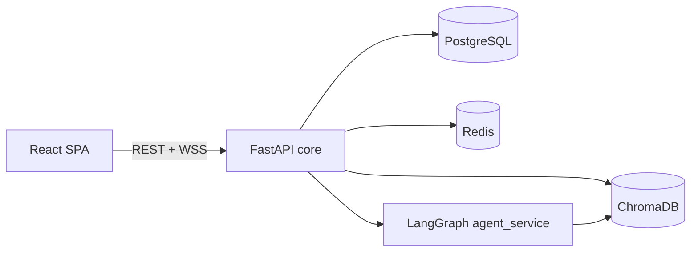

# Pally

Ứng dụng chat **AI companion** giao diện lấy cảm hứng từ **Visual Novel** (layout, thoại dạng narrative, portrait). Backend **FastAPI** + **LangGraph** trong cùng một tiến trình Python; dữ liệu **PostgreSQL**, **Redis**, **ChromaDB** (RAG khi cấu hình).

---

## Tài liệu (đọc theo mục lục)

Toàn bộ tài liệu kỹ thuật nằm trong [`docs/`](./docs/README.md).

| # | File | Nội dung |
|---|------|----------|
| — | [`docs/README.md`](./docs/README.md) | **Mục lục** và gợi ý lộ trình đọc |
| 01 | [`docs/01-architecture.md`](./docs/01-architecture.md) | Kiến trúc, luồng chat UI + backend |
| 02 | [`docs/02-local-development.md`](./docs/02-local-development.md) | Cài đặt local, `.env`, Docker Compose, cổng |
| 03 | [`docs/03-data-and-storage.md`](./docs/03-data-and-storage.md) | PostgreSQL, Redis, ChromaDB |
| 04 | [`docs/04-api-overview.md`](./docs/04-api-overview.md) | REST, `/health`, WebSocket `/chat/ws` |
| 05 | [`docs/05-agent-pipeline.md`](./docs/05-agent-pipeline.md) | LangGraph, intent → node |
| 06 | [`docs/06-roadmap-infra.md`](./docs/06-roadmap-infra.md) | Roadmap hạ tầng |
| 07 | [`docs/07-security-and-secrets.md`](./docs/07-security-and-secrets.md) | JWT, CORS, production |
| 08 | [`docs/08-troubleshooting.md`](./docs/08-troubleshooting.md) | WS, DB, FAQ |
| 09 | [`docs/09-aws-ecr-ecs.md`](./docs/09-aws-ecr-ecs.md) | AWS ECR + deploy |
| 10 | [`docs/10-aws-run-app-prep.md`](./docs/10-aws-run-app-prep.md) | Chuẩn bị RDS + Secrets Manager |

---

## Tính năng

**Frontend (`frontend/src/pages/Chat.tsx`, components liên quan)**

- **Thoại bot:** Nội dung assistant được **cắt thành các khối ngữ nghĩa** (`splitIntoSemanticBlocks`), render **Markdown** qua `ChatMarkdown`.
- **Stream:** Ưu tiên **WebSocket** (`stream_start` / token / `stream_end`); fallback **REST** nếu WS không dùng được.
- **Voice transcription:** Deepgram Nova-3 (primary) → Groq Whisper (fallback).
- **Vision analysis:** Gemini 1.5 Pro (primary) → GPT-4o (fallback) — nhận diện nhân vật, vật thể, bối cảnh.
- **Image generation:** `/imagine` slash command via Replicate FLUX.
- **Games:** Chess, Caro, Tetris, Snake, Ringrealms (RTS nhúng) trong chat.
- **Diary, Memory, Relationship** tabs trong chat.

**Backend (`services/core` + `services/agent_service`)**

- **Auth** + **Chat** (REST + WebSocket `/chat/ws`).
- **LangGraph** (`workflow.py`): `classifier` → `emotion` → node theo intent.
- **LLM** (`llm/client.py`): Claude 3.5 Sonnet (primary), fallback Groq / OpenAI.
- **Vision:** Gemini 1.5 Pro, fallback GPT-4o.
- **Voice:** Deepgram Nova-3, fallback Groq Whisper.

---

## Kiến trúc (tổng quan)


```mermaid
flowchart LR
  Browser[React SPA] -->|REST + WSS| API[FastAPI core]
  API --> PG[(PostgreSQL)]
  API --> Redis[(Redis)]
  API --> Chroma[(ChromaDB)]
  API --> LangGraph[LangGraph agent_service]
  LangGraph --> Chroma
```

Chi tiết: [`docs/01-architecture.md`](./docs/01-architecture.md).

---

## Cấu trúc thư mục

```
├── docs/              # Tài liệu kỹ thuật (mục lục: docs/README.md)
├── frontend/          # React + Vite + TypeScript + Tailwind
├── services/
│   ├── core/          # FastAPI — auth, chat, API
│   └── agent_service/ # LangGraph — agents, RAG, LLM
├── migrations/        # Alembic
├── requirements.txt
├── docker-compose.yml
├── Makefile
└── README.md
```

---

## Yêu cầu môi trường

- Python **3.10+**
- Node.js **18+**
- **Docker** + Docker Compose

Copy `.env.example` → `.env` và điền giá trị. Chi tiết: [`docs/02-local-development.md`](./docs/02-local-development.md).

---

## Chạy nhanh

### 1. Hạ tầng dữ liệu

```bash
docker compose up -d
```

### 2. Backend

```bash
python -m venv .venv
.venv\Scripts\activate   # Windows
pip install -r requirements.txt
uvicorn services.core.main:app --reload --port 8000
```

### 3. Frontend

```bash
cd frontend
npm install
npm run dev
```

- UI: **http://localhost:5173**
- API: **http://localhost:8000** — OpenAPI `/docs` khi bật (môi trường dev).

---

## License

MIT
