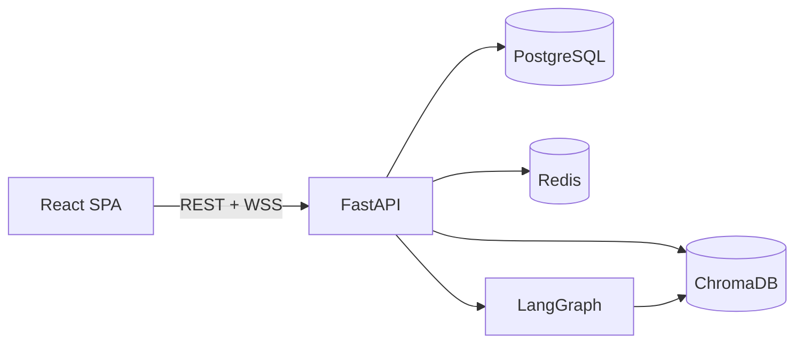

# Pally

AI companion chat app với giao diện Visual Novel. Backend **FastAPI** + **LangGraph**; dữ liệu **PostgreSQL**, **Redis**, **ChromaDB**.

---

## Tech Stack

### Backend
| Layer | Tech |
|-------|------|
| API | FastAPI + Uvicorn |
| Agent | LangGraph (StateGraph) |
| LLM Chat | Claude 3.5 Sonnet (Anthropic) |
| LLM Fallback | Groq Llama 3.3 70B |
| Vision | Gemini 1.5 Pro → GPT-4o |
| Voice | Deepgram Nova-3 → Groq Whisper |
| Image Gen | Replicate FLUX Kontext Pro |
| Web Search | Tavily |
| DB | PostgreSQL (asyncpg + SQLAlchemy) |
| Cache | Redis |
| Vector Store | ChromaDB |
| Auth | JWT (HS256) + Google OAuth |
| Migration | Alembic |

### Frontend
| Layer | Tech |
|-------|------|
| Framework | React 18 + Vite + TypeScript |
| Styling | Tailwind CSS (ONME palette) |
| Routing | React Router v6 |
| Realtime | WebSocket (native) |
| Games | Chess, Caro, Tetris, Snake, Ringrealms |

### Infrastructure
| Layer | Tech |
|-------|------|
| Container | Docker + Docker Compose |
| Registry | Amazon ECR |
| CI | GitHub Actions |
| Cloud | AWS (ECS Fargate / App Runner) |

---

## Architecture


```mermaid
flowchart LR
  Browser[React SPA] -->|REST + WSS| API[FastAPI]
  API --> PG[(PostgreSQL)]
  API --> Redis[(Redis)]
  API --> Chroma[(ChromaDB)]
  API --> LangGraph[LangGraph]
  LangGraph --> Chroma
```

Chi tiết: [`docs/01-architecture.md`](./docs/01-architecture.md)

---

## Agent Pipeline

```
User message
  → classifier (intent hybrid)
  → emotion node
  → route: chit_chat | guardrail | entertainment_expert | comfort | advice | crisis
  → END
```

Chi tiết: [`docs/05-agent-pipeline.md`](./docs/05-agent-pipeline.md)

---

## API Endpoints

| Method | Path | Mô tả |
|--------|------|-------|
| WS | `/chat/ws` | Stream chat |
| POST | `/chat` | REST chat |
| POST | `/chat/transcribe` | Voice → text |
| POST | `/chat/analyze-media` | Vision analysis |
| POST | `/chat/imagine` | Text → image |
| GET | `/health` | Health check |

Chi tiết: [`docs/04-api-overview.md`](./docs/04-api-overview.md)

---

## Cấu trúc thư mục

```
├── docs/
├── frontend/          # React + Vite + TypeScript
├── services/
│   ├── core/          # FastAPI — auth, chat, API
│   └── agent_service/ # LangGraph — agents, RAG, LLM
├── migrations/        # Alembic
├── requirements.txt
├── docker-compose.yml
└── .env.example
```

---

## Environment

Copy `.env.example` → `.env`.

---

## License

MIT
