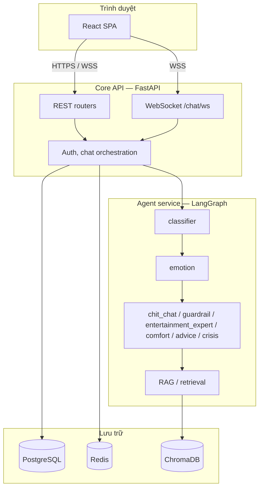

# 01 — Kiến trúc hệ thống

## 1.1 Tóm tắt

VirFriendo là **monorepo**:

- **Frontend:** React + Vite + TypeScript + Tailwind — giao diện theo phong cách VN (stage, narrative, portrait), **không** phải engine VN riêng.
- **Backend:** một process **FastAPI** (`services.core`) gọi **LangGraph** trong `services.agent_service` (cùng tiến trình Python, không tách HTTP mặc định).

Tách microservice là tùy chọn sau (xem [06-roadmap-infra.md](./06-roadmap-infra.md)).

## 1.2 Luồng chat trên UI (đối chiếu code)

| Hành vi | Nơi triển khai |
|---------|----------------|
| Tách nội dung assistant thành **khối** (đoạn / câu gộp theo ngữ nghĩa) | `splitIntoSemanticBlocks` trong `frontend/src/pages/Chat.tsx` |
| Render từng khối **Markdown** | `ChatMarkdown`, variant `narrative` |
| **WebSocket** stream token (`stream_start` → chunk → `stream_end`) | `Chat.tsx` + handler WS; con trỏ nhấp nháy khi đang stream message cuối |
| REST fallback khi không có WS | `api.sendMessage` trong `handleSend` |
| Click khối → popup đọc text khối | `onClick` / `sentencePopup` trên `.vf-chat-narrative-block` |
| Animation **chữ từng ký tự** (stagger) | Chỉ **`KaraokeQuestion`** trong `ChatEntryGate.tsx` (câu hỏi bước tạo nhân vật), **không** áp dụng cho toàn bộ thoại trong chat |

Các field `chunks` / `visibleChunkIndex` trong `MessageItem` (`types/chat.ts`) phục vụ mô hình dữ liệu; **hiển thị thực tế** dùng `splitIntoSemanticBlocks` trên `content` full sau khi stream xong.

## 1.3 Sơ đồ tổng quan (backend + data)

## 1.4 Đồ thị LangGraph (intent → node)

Trong `services/agent_service/graph/workflow.py`:

- `intent` (từ classifier) được map sang route:
  - `greeting_chitchat` → `chit_chat`
  - `out_of_domain` → `guardrail`
  - `entertainment_knowledge` → `entertainment_expert`
  - `psychology_venting` → `comfort`
  - `psychology_advice_seeking` → `advice`
  - `crisis_alert` hoặc `emotion == crisis` → `crisis`

Mỗi node kết thúc tại `END`.

## 1.5 Thành phần chính

| Thành phần | Đường dẫn / ghi chú |
|------------|---------------------|
| Ứng dụng HTTP | `services/core/main.py` — CORS, TrustedHost, lifespan DB |
| Auth & user | `services/core/api/auth.py` |
| Chat & WS | `services/core/api/chat.py` |
| Game / diary / agents API | `services/core/api/game.py`, `diary.py`, `agents.py`, `caro.py`, `external_game.py`, … |
| LangGraph | `services/agent_service/graph/workflow.py`, `agents.py`, `state.py` |
| LLM | `services/agent_service/llm/client.py` — OpenAI hoặc Groq theo biến môi trường |
| Cấu hình | `services/core/config.py` — `DATABASE_URL`, `SECRET_KEY`, `CORS_ORIGINS`, … |

## 1.6 Ranh giới (boundaries)

- **`services/core`:** HTTP, persistence, gọi graph khi xử lý tin nhắn.
- **`services/agent_service`:** intent, emotion, node agent, RAG; không mở cổng HTTP riêng trong setup mặc định.

## 1.7 Endpoint kiểm tra nhanh

- `GET /health` — JSON `status`, `project`, `version`.
- OpenAPI: khi không phải production hoặc `DEBUG=true`, có `/docs` (xem `main.py`).
