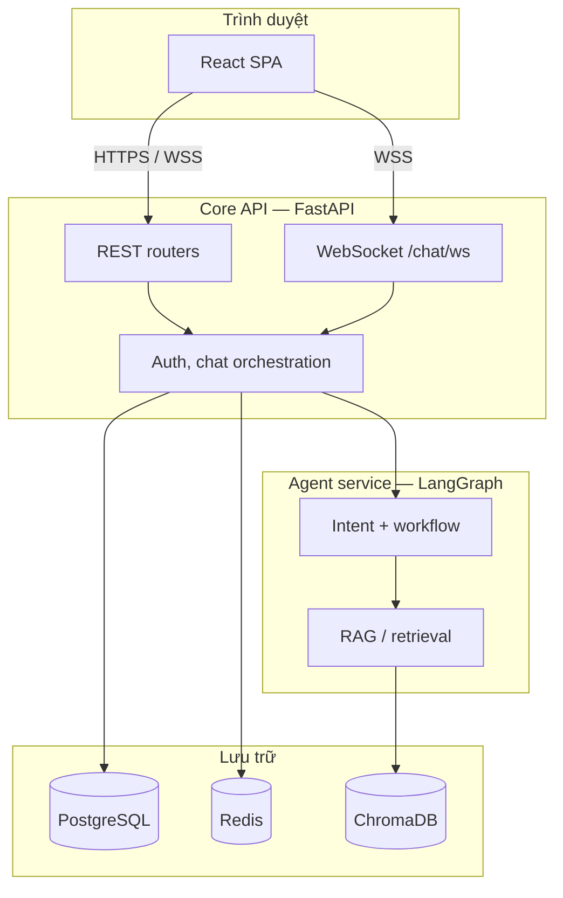

# 01 — Kiến trúc hệ thống

## 1.1 Tóm tắt

VirFriendo là **monorepo** gồm:

- **Frontend:** React + Vite + TypeScript + Tailwind (UI Visual Novel).
- **Backend:** một process **FastAPI** (`services.core`) import và chạy pipeline **LangGraph** trong `services.agent_service` (cùng tiến trình Python, không phải microservice tách network mặc định).

Điều này giữ độ trễ thấp cho chat và đơn giản hoá triển khai giai đoạn đầu; tách service riêng là bước tùy chọn sau (xem [06-roadmap-infra.md](./06-roadmap-infra.md)).

## 1.2 Sơ đồ tổng quan

## 1.3 Thành phần chính

| Thành phần | Đường dẫn / ghi chú |
|------------|---------------------|
| Ứng dụng HTTP | `services/core/main.py` — CORS, TrustedHost, lifespan DB |
| Auth & user | `services/core/api/auth.py` |
| Chat & WS | `services/core/api/chat.py` |
| Game / diary / agents API | `services/core/api/game.py`, `diary.py`, `agents.py`, … |
| LangGraph | `services/agent_service/graph/` — workflow, state, các node agent |
| Cấu hình | `services/core/config.py` — `DATABASE_URL`, `SECRET_KEY`, `CORS_ORIGINS`, … |

## 1.4 Ranh giới (boundaries)

- **`services/core`:** HTTP, persistence (SQLAlchemy), gọi vào graph agent khi xử lý tin nhắn.
- **`services/agent_service`:** logic LLM, phân loại intent, RAG; không bind cổng HTTP riêng trong setup mặc định.

## 1.5 Endpoint kiểm tra nhanh

- `GET /health` — trạng thái API (dùng cho load balancer / probe sau này).
- OpenAPI: khi `APP_ENV` không phải production hoặc `DEBUG=true`, có `/docs` và `/openapi.json` (xem `main.py`).
