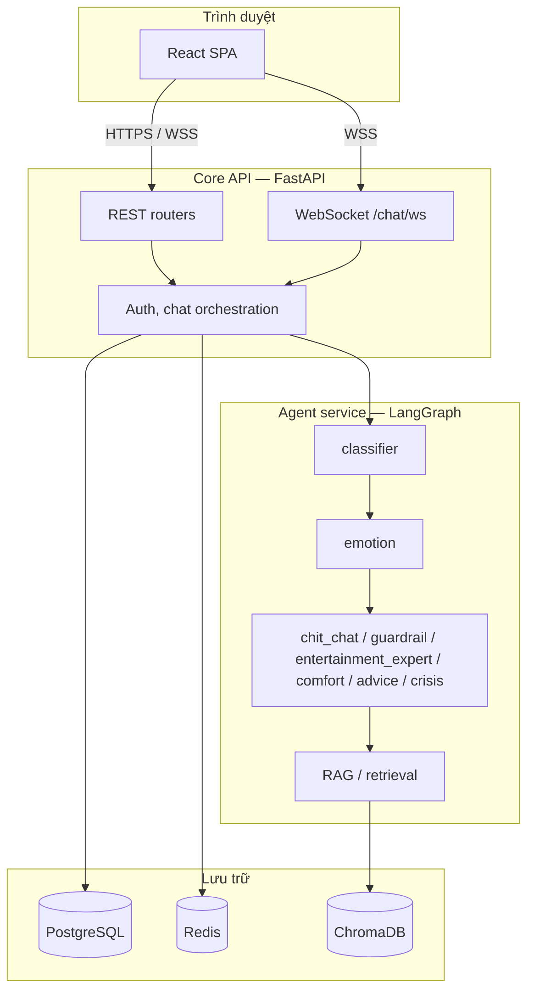

# 01 — Kiến trúc hệ thống

## 1.1 Tóm tắt

Pally là **monorepo**:

- **Frontend:** React + Vite + TypeScript + Tailwind — giao diện theo phong cách VN (stage, narrative, portrait).
- **Backend:** một process **FastAPI** (`services.core`) gọi **LangGraph** trong `services.agent_service` (cùng tiến trình Python).

## 1.2 Luồng chat trên UI

| Hành vi | Nơi triển khai |
|---------|----------------|
| Cắt nội dung assistant thành **khối ngữ nghĩa** | `splitIntoSemanticBlocks` trong `frontend/src/pages/Chat.tsx` |
| Render **Markdown** | `ChatMarkdown`, variant `narrative` |
| **WebSocket** stream token | `Chat.tsx` + handler WS |
| REST fallback | `api.sendMessage` trong `handleSend` |
| **Voice transcription** | `POST /chat/transcribe` — Deepgram Nova-3 → Groq Whisper |
| **Vision analysis** | `POST /chat/analyze-media` — Gemini 1.5 Pro → GPT-4o |
| **Image generation** | `POST /chat/imagine` — Replicate FLUX |

## 1.3 Sơ đồ tổng quan

```mermaid
flowchart TB
  subgraph client["Trình duyệt"]
    UI[React SPA]
  end
  subgraph api["Core API — FastAPI"]
    REST[REST routers]
    WS[WebSocket /chat/ws]
    REST --> CoreLogic
    WS --> CoreLogic
    CoreLogic[Auth, chat orchestration]
  end
  subgraph agents["Agent service — LangGraph"]
    CL[classifier]
    EM[emotion]
    CL --> EM
    EM --> Nodes[chit_chat / guardrail / entertainment_expert / comfort / advice / crisis]
    RAG[RAG / retrieval]
  end
  subgraph data["Lưu trữ"]
    PG[(PostgreSQL)]
    RD[(Redis)]
    CH[(ChromaDB)]
  end
  UI -->|HTTPS / WSS| REST
  UI -->|WSS| WS
  CoreLogic --> CL
  Nodes --> RAG
  CoreLogic --> PG
  CoreLogic --> RD
  RAG --> CH
```

## 1.4 Đồ thị LangGraph (intent → node)

| Intent | Node |
|--------|------|
| `greeting_chitchat` | `chit_chat` |
| `out_of_domain` | `guardrail` |
| `entertainment_knowledge` | `entertainment_expert` |
| `psychology_venting` | `comfort` |
| `psychology_advice_seeking` | `advice` |
| `crisis_alert` / `emotion == crisis` | `crisis` |

## 1.5 Thành phần chính

| Thành phần | Đường dẫn |
|------------|-----------|
| Ứng dụng HTTP | `services/core/main.py` |
| Auth & user | `services/core/api/auth.py` |
| Chat, Voice, Vision, Imagine | `services/core/api/chat.py` |
| Game / diary / agents | `services/core/api/game.py`, `diary.py`, `agents.py`, `caro.py` |
| LangGraph | `services/agent_service/graph/workflow.py` |
| LLM client | `services/agent_service/llm/client.py` |
| Cấu hình | `services/core/config.py` |

## 1.6 LLM Providers

| Provider | Dùng cho | Biến môi trường |
|----------|----------|-----------------|
| Claude 3.5 Sonnet | Chat (primary) | `ANTHROPIC_API_KEY`, `LLM_PROVIDER=claude` |
| Groq Llama | Chat (fallback) | `GROQ_API_KEY` |
| Gemini 1.5 Pro | Vision (primary) | `GEMINI_API_KEY` |
| GPT-4o | Vision (fallback) | `OPENAI_API_KEY` |
| Deepgram Nova-3 | Voice (primary) | `DEEPGRAM_API_KEY` |
| Groq Whisper | Voice (fallback) | `GROQ_API_KEY` |
| Replicate FLUX | Image generation | `REPLICATE_API_TOKEN` |

## 1.7 Endpoint kiểm tra nhanh

- `GET /health` — JSON `status`, `project`, `version`.
- OpenAPI: `/docs` khi `DEBUG=true` hoặc không phải production.
