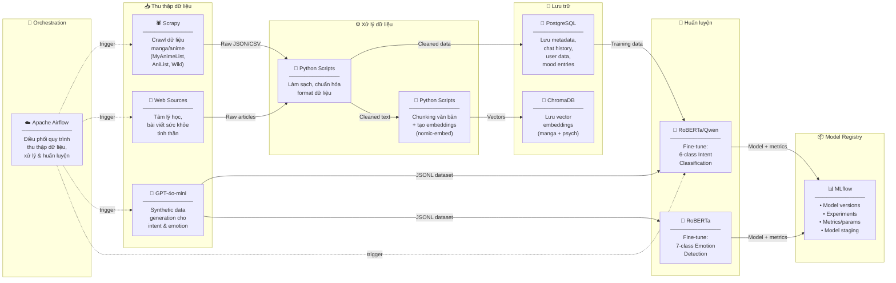
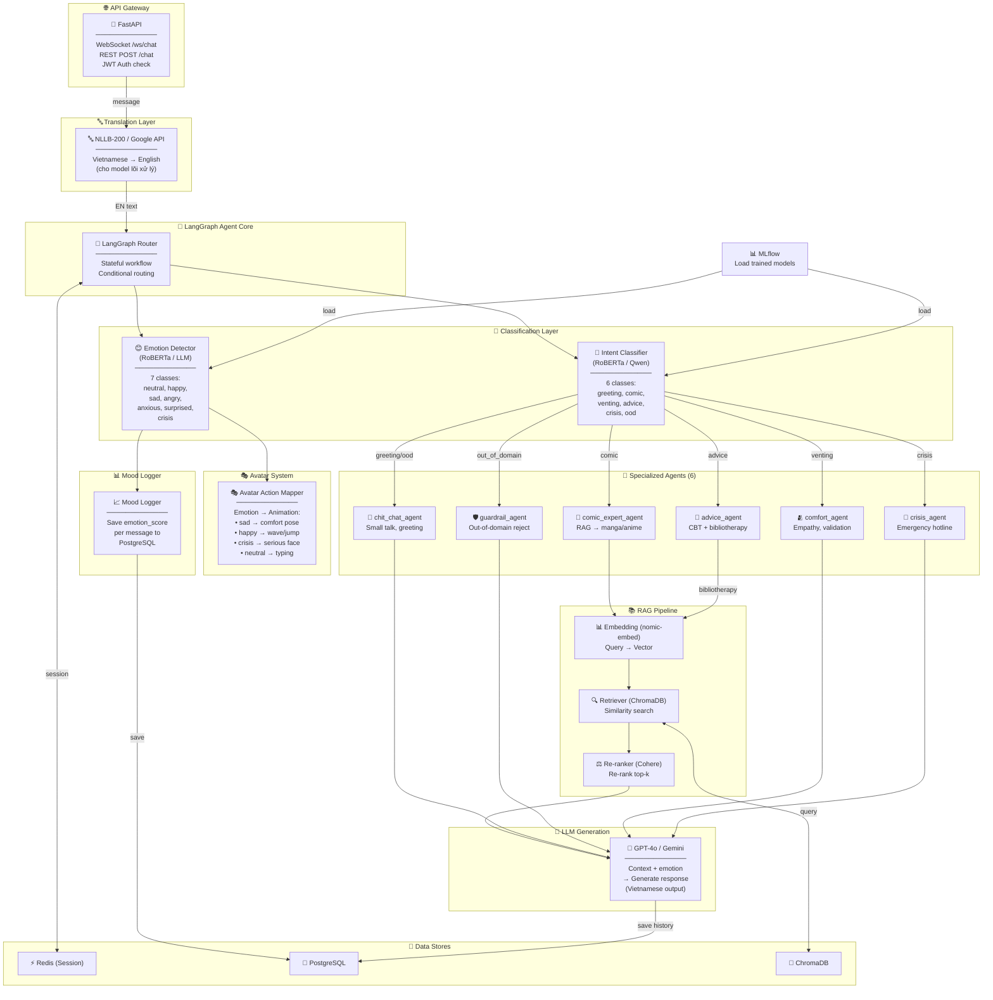
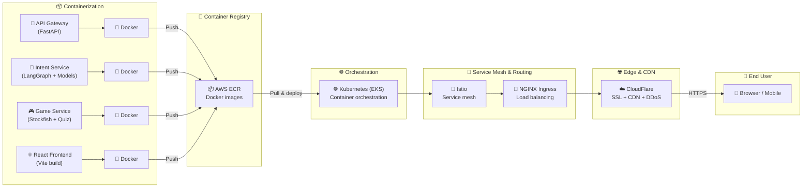
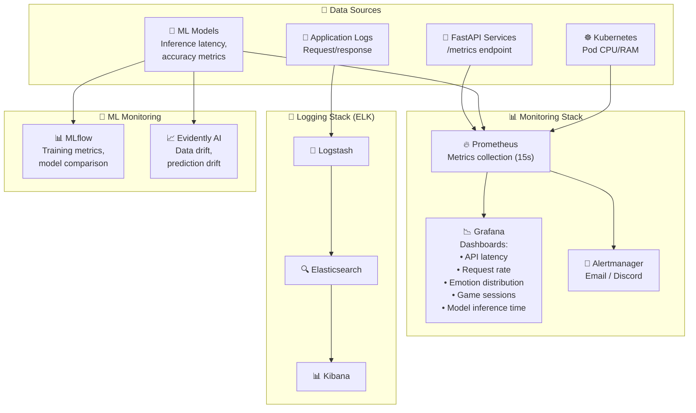
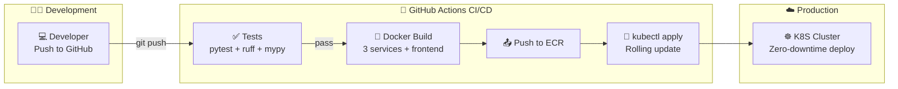
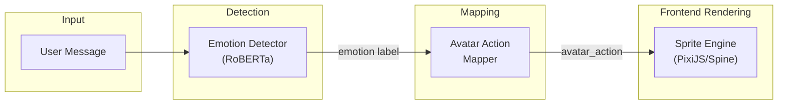
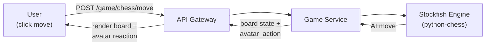
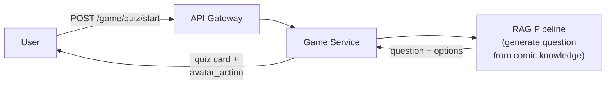

# 🏗️ Kiến trúc Hệ thống — VirFriendo (AI Anime Companion)

> **Đề tài:** Nghiên cứu và xây dựng **VirFriendo** — AI Anime Companion: Tích hợp Intent Classification, Emotion Detection, RAG tri thức chuyên sâu và Module tương tác cảm xúc cho hội thoại đa ngữ cảnh.

> **Xem trước:** [01_project_plan.md](01_project_plan.md) để nắm tổng quan tính năng và tech stack.

---

## 0. Tổng quan hệ thống (System Overview)

Hệ thống gồm 3 service chính chạy trên Docker, giao tiếp qua REST/gRPC nội bộ:

```
┌─────────────────────────────────────────────────────────────────────┐
│                     FRONTEND (React + Vite + TS)                    │
│  ┌──────────┐  ┌───────────────┐  ┌──────────┐  ┌──────────────┐  │
│  │ Chat UI  │  │ Avatar Canvas │  │ Game UI  │  │ Mood Chart   │  │
│  │ messages │  │ emotion-driven│  │ chess +  │  │ timeline +   │  │
│  │ + input  │  │ sprite anim   │  │ quiz     │  │ summary      │  │
│  └────┬─────┘  └──────┬────────┘  └────┬─────┘  └──────┬───────┘  │
│       └────────────────┴────────────────┴───────────────┘          │
│                        WebSocket + REST API                         │
└──────────────────────────────┬──────────────────────────────────────┘
                               │
┌──────────────────────────────▼──────────────────────────────────────┐
│                    API GATEWAY (FastAPI)                             │
│  /auth  /chat  /ws/chat  /game  /mood  /history                    │
│  ┌──────────┐  ┌──────────┐  ┌──────────┐  ┌──────────────────┐   │
│  │ JWT Auth │  │ Session  │  │ Rate     │  │ Request Routing  │   │
│  │          │  │ (Redis)  │  │ Limiter  │  │ → Intent Service │   │
│  └──────────┘  └──────────┘  └──────────┘  └──────────────────┘   │
└──────────────────────────────┬──────────────────────────────────────┘
                               │
┌──────────────────────────────▼──────────────────────────────────────┐
│                  INTENT SERVICE (LangGraph Agent Core)               │
│                                                                      │
│  ┌────────────┐  ┌──────────────┐  ┌────────────┐  ┌────────────┐  │
│  │Translation │─▶│ Intent       │─▶│ Emotion    │─▶│ Avatar     │  │
│  │ (VN→EN)    │  │ Classifier   │  │ Detector   │  │ Action Map │  │
│  └────────────┘  └──────┬───────┘  └────────────┘  └────────────┘  │
│                          │                                           │
│        ┌─────────────────┼─────────────────────────┐                │
│        ▼                 ▼                          ▼                │
│  ┌───────────┐  ┌──────────────┐  ┌──────────────────────────────┐ │
│  │chit_chat  │  │comfort_agent │  │ comic_expert (RAG Pipeline)  │ │
│  │guardrail  │  │advice_agent  │  │ embed → retrieve → rerank    │ │
│  │           │  │crisis_agent  │  │          → LLM generate      │ │
│  │           │  │              │  │                               │ │
│  └───────────┘  └──────────────┘  └──────────────────────────────┘ │
│                          │                                           │
│                    ┌─────▼─────┐                                     │
│                    │ Mood      │                                     │
│                    │ Logger    │                                     │
│                    └───────────┘                                     │
└──────────────────────────────┬──────────────────────────────────────┘
                               │
┌──────────────────────────────▼──────────────────────────────────────┐
│                        GAME SERVICE                                  │
│  ┌──────────────────┐  ┌──────────────────────────────────────┐    │
│  │ Chess Engine      │  │ Anime Quiz Engine                    │    │
│  │ (Stockfish +      │  │ (RAG-powered question generation)   │    │
│  │  python-chess)    │  │                                      │    │
│  └──────────────────┘  └──────────────────────────────────────┘    │
└─────────────────────────────────────────────────────────────────────┘
                               │
┌──────────────────────────────▼──────────────────────────────────────┐
│                         DATA LAYER                                   │
│  ┌──────────┐  ┌──────────┐  ┌──────────┐  ┌──────────────────┐   │
│  │PostgreSQL│  │ ChromaDB │  │  Redis   │  │    MLflow        │   │
│  │• users   │  │• manga   │  │• session │  │ • model versions │   │
│  │• messages│  │  vectors │  │• cache   │  │ • experiments    │   │
│  │• mood    │  │• psych   │  │• rate    │  │ • metrics        │   │
│  │• games   │  │  vectors │  │  limit   │  │                  │   │
│  └──────────┘  └──────────┘  └──────────┘  └──────────────────┘   │
└─────────────────────────────────────────────────────────────────────┘
```

---

## 1. Pipeline chi tiết — Dữ liệu & Huấn luyện Model

> Luồng từ thu thập dữ liệu → xử lý → lưu trữ → huấn luyện → đăng ký model



---

## 2. Pipeline chi tiết — Backend Application (Request Flow)

> Luồng xử lý từ user message → qua Agent Core → response + emotion + avatar action



### Response Format

Mỗi response từ backend trả về cho frontend:

```json
{
    "reply": "Ê, hôm nay sao rồi? Mặt cậu trông buồn buồn thế?",
    "detected_intent": "greeting_chitchat",
    "detected_emotion": "neutral",
    "avatar_action": "wave_greeting",
    "mood_score": 0.6,
    "bibliotherapy_suggestion": null,
    "metadata": {
        "relationship_level": 2,
        "response_time_ms": 245
    }
}
```

Frontend sử dụng `avatar_action` để trigger animation cho avatar, `detected_emotion` để hiển thị emotion badge.

---

## 3. Pipeline chi tiết — Containerization & Deployment

> Đóng gói → Triển khai → Networking → User



---

## 4. Pipeline chi tiết — Monitoring & Logging

> Giám sát hệ thống, logs, và hiệu suất model



---

## 5. Pipeline chi tiết — CI/CD

> Từ code commit → test → build → deploy tự động



---

## 6. Emotion-Driven Avatar System (Unique Feature)

Đây là tính năng cốt lõi để phân biệt với Character.ai:



### Emotion → Avatar Action Mapping Table

| Detected Emotion | Avatar Action Key | Animation Description |
|:-----------------|:------------------|:---------------------|
| `neutral` | `idle_typing` | Ngồi gõ keyboard, thỉnh thoảng nhìn lên |
| `happy` | `excited_wave` | Mắt sáng, vẫy tay, nhảy nhẹ |
| `sad` | `comfort_sit` | Nghiêng đầu, mắt buồn, ngồi cạnh |
| `angry` | `crossed_arms` | Khoanh tay, nhăn mặt nhẹ, tỏ vẻ bực mình cùng user |
| `anxious` | `hold_hand` | Nắm tay (symbolic), biểu cảm lo lắng |
| `surprised` | `shocked_face` | Mắt tròn, miệng O, tay giơ lên |
| `crisis` | `serious_alert` | Biểu cảm nghiêm túc, icon hotline xuất hiện |

### Sprite Sheet Structure

```
frontend/public/sprites/
├── idle/
│   ├── idle_typing_01.png → idle_typing_12.png
│   └── idle_look_around_01.png → idle_look_around_08.png
├── emotions/
│   ├── happy_wave_01.png → happy_wave_10.png
│   ├── sad_comfort_01.png → sad_comfort_08.png
│   ├── angry_arms_01.png → angry_arms_06.png
│   ├── anxious_hold_01.png → anxious_hold_08.png
│   ├── surprised_01.png → surprised_06.png
│   └── crisis_serious_01.png → crisis_serious_04.png
├── game/
│   ├── chess_thinking_01.png → chess_thinking_06.png
│   ├── chess_happy_01.png → chess_happy_04.png
│   └── quiz_excited_01.png → quiz_excited_06.png
└── transitions/
    └── ... (animation transitions between states)
```

---

## 7. Game Integration Architecture

### Chess



Avatar reactions khi chơi Chess:
- User đi hay → `surprised` → "Nước đi đẹp đấy!"
- AI đang nghĩ → `chess_thinking` animation
- AI ăn quân → `happy` → "Hehe, bắt được rồi~"
- AI sắp thua → `anxious` → "Khoan... cậu giỏi thật đấy 😤"

### Anime Quiz



---

## 8. Tech Stack tổng hợp

| Layer | Technology | Vai trò |
|:------|:-----------|:--------|
| **Frontend** | React 18 + Vite + TypeScript | SPA responsive |
| **UI/Animation** | TailwindCSS + Framer Motion | Styling + transitions |
| **Avatar Engine** | PixiJS / Spine | Sprite rendering & animation |
| **State (Client)** | Zustand | Client-side state management |
| **API Gateway** | FastAPI | REST + WebSocket + JWT Auth |
| **Agent Core** | LangGraph | Stateful graph-based agent routing |
| **Intent Model** | RoBERTa / Qwen 2.5 (fine-tuned) | 6-class intent classification |
| **Emotion Model** | RoBERTa (fine-tuned) | 7-class emotion detection |
| **LLM** | GPT-4o / Gemini | Response generation |
| **RAG Embedding** | nomic-embed / all-MiniLM-L6 | Text → vector |
| **RAG Store** | ChromaDB | Vector similarity search |
| **RAG Re-rank** | Cohere Rerank / Cross-encoder | Re-rank results |
| **Translation** | NLLB-200 / Google Translate API | VN ↔ EN |
| **TTS** | VOICEVOX / Edge TTS | Anime voice output (P2) |
| **Chess Engine** | Stockfish + python-chess | Chess AI |
| **Database** | PostgreSQL 16 | Users, chat, mood, games |
| **Cache** | Redis 7 | Session, rate limiting |
| **ML Registry** | MLflow | Model versioning |
| **Data Pipeline** | Apache Airflow + Scrapy | Data collection & processing |
| **Containerization** | Docker + Docker Compose | Service packaging |
| **Registry** | AWS ECR | Docker image storage |
| **Orchestration** | Kubernetes (EKS) | Production deployment |
| **Service Mesh** | Istio | Inter-service traffic |
| **Ingress** | NGINX Ingress | Load balancing |
| **CDN/Edge** | CloudFlare | SSL, CDN, DDoS |
| **Monitoring** | Prometheus + Grafana | Metrics & dashboards |
| **Logging** | ELK Stack | Centralized logging |
| **ML Monitoring** | Evidently AI | Drift detection |
| **CI/CD** | GitHub Actions | Automated pipeline |
| **IaC** | Terraform | Infrastructure provisioning |

---

## 9. Mapping bài toán CS221

| # | Bài toán | Module | Tech | Unique Value |
|:-:|:---------|:-------|:-----|:-------------|
| 1 | **RAG** | RAG Pipeline | nomic-embed + ChromaDB + Re-ranker + LLM | Comic knowledge + Bibliotherapy |
| 2 | **Chọn lọc thông tin** | Retriever + Re-ranker | Cohere Rerank / Cross-encoder | Top-k ranking cho manga data |
| 3 | **Phân tích cảm xúc** | Emotion Detection + Mood Tracking | RoBERTa fine-tuned 7-class | Drive avatar animation |
| 4 | **Quản lý ngữ cảnh** | Context Manager + Relationship | Redis + PostgreSQL + LangGraph State | Adaptive personality |
| 5 | **Nhận định định tuyến** | Intent Classification + Translation | NLLB → RoBERTa 8-class → LangGraph Router | 8 agent routing |
