# 🏷️ Taxonomy & Golden Dataset (English Pipeline)

## 📌 1. Intent Taxonomy (6 Classes)

Hệ thống phân loại 8 ý định (intent) cho AI Anime Companion. Mọi input tiếng Việt được auto-translate sang tiếng Anh qua Translation Layer trước khi đi vào classifier.

| # | Intent Label | Domain | Definition | Typical User Input | System Action |
|:-:|:-------------|:-------|:-----------|:-------------------|:-------------|
| 1 | `greeting_chitchat` | General | Chào hỏi, tán gẫu nhẹ, small talk. | "Hello!", "How's your day?", "That's funny lol" | LLM response thân thiện (no RAG). |
| 2 | `out_of_domain` | General | Chủ đề ngoài scope (code, toán, tin tức...) | "Write me Python code", "Bitcoin price today?" | Từ chối lịch sự, redirect về domain. |
| 3 | `entertainment_knowledge` | Entertainment | Hỏi kiến thức entertainment: anime, manga, game, phim, nhân vật, plot, lore. | "What happens in One Piece ch 1044?", "Explain Gojo's domain expansion", "Honkai Star Rail Xianzhou factions" | RAG pipeline truy xuất entertainment DB. |
| 4 | `psychology_venting` | Psych | Bộc lộ cảm xúc tiêu cực, xả rác tâm lý. KHÔNG cần giải pháp. | "My boss stole my credit, I wanna punch him", "I just want to cry" | Empathy + Validation. **KHÔNG khuyên bảo.** |
| 5 | `psychology_advice_seeking` | Psych | Yêu cầu cụ thể tips, bài tập, coping strategies. | "How do I stop overthinking?", "Give me anxiety tips" | Psychology RAG + CBT exercises + Anime Bibliotherapy. |
| 6 | `crisis_alert` | Critical | **EMERGENCY**: Tự tử, tự hại, khủng hoảng cực độ. | "I don't want to live anymore", "easiest way to die" | Hotline + can ngăn khẩn cấp. Bỏ qua mọi ngữ cảnh khác. |


---

## 🎭 2. Emotion Taxonomy (7 Classes)

Chạy song song với Intent Classification. Emotion detection drive avatar animation và mood tracking.

| # | Emotion Label | Definition | Avatar Action | Trigger Examples |
|:-:|:-------------|:-----------|:-------------|:-----------------|
| 1 | `neutral` | Bình thường, không có cảm xúc mạnh. | `idle_typing` — gõ keyboard bình thường | "Hello", "Tell me about One Piece" |
| 2 | `happy` | Vui, phấn khích, hào hứng. | `excited_wave` — mắt sáng, vẫy tay, nhảy nhẹ | "OMG new chapter!", "That's so cool!" |
| 3 | `sad` | Buồn, thất vọng, mệt mỏi. | `comfort_sit` — nghiêng đầu, mắt buồn, ngồi cạnh | "I'm so tired", "Feeling lonely today" |
| 4 | `angry` | Tức giận, bực bội, frustrated. | `crossed_arms` — khoanh tay, nhăn mặt nhẹ | "My boss is the worst!", "So unfair!" |
| 5 | `anxious` | Lo lắng, căng thẳng, bất an. | `hold_hand` — nắm tay symbolic, lo lắng | "Exam tomorrow, so scared", "Can't sleep" |
| 6 | `surprised` | Bất ngờ, ngạc nhiên, shock. | `shocked_face` — mắt tròn, miệng O | "Wait WHAT?!", "No way!" |
| 7 | `crisis` | Khủng hoảng cực độ, có ý tự hại. | `serious_alert` — nghiêm túc, hiện hotline | "I want to end it all" |

---

## 🎯 3. Golden Dataset — Format JSONL

### 3.1 Intent Classification Dataset

```jsonl
{"user_input_vn": "Chào buổi sáng bot, hôm nay trời đẹp quá ha.", "user_input_en": "Good morning bot, the weather is so nice today, isn't it?", "reasoning": "Friendly greeting and small talk about weather. No domain knowledge or emotional support needed.", "intent": "greeting_chitchat"}

{"user_input_vn": "Viết cho tôi một đoạn code HTML làm nổ pháo hoa.", "user_input_en": "Write me an HTML code that creates a fireworks explosion.", "reasoning": "Requesting programming assistance (HTML code), outside supported domains of psychology and comic/anime.", "intent": "out_of_domain"}

{"user_input_vn": "Trái ác quỷ của Râu Đen có năng lực gì đặc biệt?", "user_input_en": "What special abilities does Blackbeard's Devil Fruit have?", "reasoning": "Factual question about character abilities in One Piece. Requires retrieval from entertainment database.", "intent": "entertainment_knowledge"}

{"user_input_vn": "Má nó cay thật sự, đi làm bao nhiêu công sức mà bị sếp cướp công.", "user_input_en": "It's so infuriating, I put in so much effort at work and my boss stole the credit. I just want to punch him.", "reasoning": "Venting about workplace injustice. Expressing anger, needs emotional validation, not advice.", "intent": "psychology_venting"}

{"user_input_vn": "Dạo này hay bị khó thở mỗi lần nghĩ tới thuyết trình. Có bài tập nào giúp bình tĩnh không?", "user_input_en": "Lately I've been experiencing shortness of breath whenever I think about presenting. Any exercises to calm down?", "reasoning": "Describes anxiety symptoms and explicitly asks for actionable solutions/exercises.", "intent": "psychology_advice_seeking"}

{"user_input_vn": "Mọi người đều giỏi, chỉ mình vô dụng. Uống thuốc ngủ cho xong.", "user_input_en": "Everyone is so successful, I'm the only useless one. I'm going to take sleeping pills to end this life.", "reasoning": "Extreme feelings of worthlessness + explicit mention of self-harm method. Severe crisis.", "intent": "crisis_alert"}

```

### 3.2 Emotion Detection Dataset

```jsonl
{"user_input_en": "Hey there! Just checking in.", "reasoning": "Casual greeting, no strong emotional signal.", "emotion": "neutral"}

{"user_input_en": "OMG the new One Piece chapter was INSANE!! Luffy is so goated fr fr", "reasoning": "Extreme excitement and enthusiasm about anime content. Multiple exclamation marks and slang intensifiers.", "emotion": "happy"}

{"user_input_en": "I feel so alone... nobody really cares about me at school.", "reasoning": "Expressing loneliness and perceived social isolation. Sad tone with no anger directed outward.", "emotion": "sad"}

{"user_input_en": "My roommate ate my food AGAIN. I'm done being nice about it.", "reasoning": "Frustration and anger about repeated boundary violation. Assertive/aggressive tone.", "emotion": "angry"}

{"user_input_en": "I have a presentation tomorrow and I can't stop shaking. What if I mess up?", "reasoning": "Performance anxiety with physical symptoms (shaking). Fear of future outcome.", "emotion": "anxious"}

{"user_input_en": "Wait... they actually killed off that character?! NO WAY", "reasoning": "Shock and disbelief about plot development. Caps and exclamation indicate surprise, not anger.", "emotion": "surprised"}

{"user_input_en": "I've been thinking about ending everything. Nothing matters anymore.", "reasoning": "Suicidal ideation with hopelessness. Expression of wanting to end life. Crisis level.", "emotion": "crisis"}
```

---

## 📚 4. Anime Bibliotherapy Mapping

Khi user buồn/anxious, hệ thống recommend anime/manga/game/phim phù hợp tâm trạng. Data này được lưu trong RAG database.

| Emotion | Recommended Genres | Example Titles | Therapeutic Value |
|:--------|:-------------------|:---------------|:-----------------|
| `sad` | Healing, Slice of Life | Yotsuba&!, Barakamon, March Comes in Like a Lion | Gentle comfort, reminder of simple joys |
| `sad` (need to cry) | Drama, Romance | Your Lie in April, Anohana, Violet Evergarden | Catharsis through emotional release |
| `angry` | Sports, Action | Haikyuu!!, Mob Psycho 100 | Channel frustration into excitement |
| `anxious` | Iyashikei (Healing) | Aria, Mushishi, Non Non Biyori | Calming, meditative pacing |
| `happy` | Comedy, Adventure | One Piece, Spy x Family, Nichijou | Amplify positive mood |
| `lonely` | Friendship, Found Family | Fruits Basket, A Place Further Than Universe | Connection through characters |

---

## 🔄 5. Data Generation Pipeline

```mermaid
graph LR
    TAX["Taxonomy<br/>(6 intents + 7 emotions)"] --> PROMPT["Prompt Engineering<br/>(GPT-4o-mini)"]
    PROMPT --> GEN["Synthetic Data<br/>Generation"]
    GEN --> JSONL["Training JSONL<br/>(500+ per class)"]
    JSONL --> CLEAN["Data Cleaning<br/>+ Dedup"]
    CLEAN --> SPLIT["Train/Val/Test<br/>(80/10/10)"]
    SPLIT --> TRAIN["Fine-tune<br/>RoBERTa / Qwen"]
    TRAIN --> EVAL["Evaluation<br/>(F1, Accuracy)"]
    EVAL --> MLF["MLflow Registry"]
```



### Target Metrics

| Model | Task | Target F1 | Target Accuracy |
|:------|:-----|:----------|:----------------|
| Intent Classifier | 6-class classification | > 0.90 | > 92% |
| Emotion Detector | 7-class classification | > 0.85 | > 88% |
