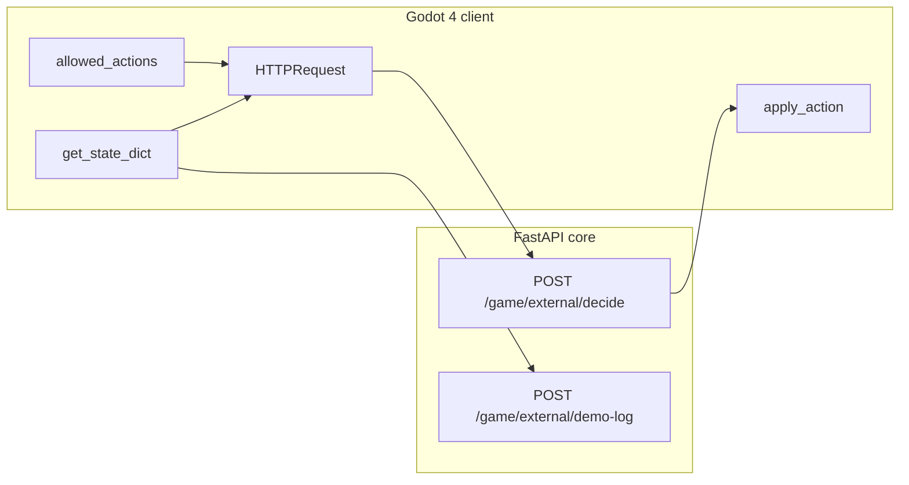

# Source of Mana ↔ companion backend (Godot 4)

This folder is a **drop-in bridge** for [Source of Mana](https://github.com/sourceofmana/sourceofmana) (or any Godot 4 project). The **game repo stays separate**; copy these scripts into your Godot `addons/` or `scripts/` tree.

## Architecture

1. **Your game** exposes a JSON-serializable `state` and a list of **legal** `actions` (strings).
2. **Backend** returns `{ "action": "...", "source": "rules|llm|fallback" }`.
3. **Optional**: while the human plays, `demo-log` appends `(state, action)` lines to `data/raw/external_game_demo.jsonl` for future imitation learning.

## Backend endpoints (requires JWT)

- `POST /game/external/decide` — body: `game_id`, `state`, `actions[]`, `emotion`, `use_llm`.
- `POST /game/external/demo-log` — body: `game_id`, `state`, `action`, optional `meta`.

Run core: `uvicorn services.core.main:app --reload` from project root. Set `OPENAI_API_KEY` or `GROQ_API_KEY` if `use_llm: true`.

## Integration phases (do in order)

| Phase | Task |
|-------|------|
| 1 | In Godot, add `GodotAiBridge` node; set `api_base_url` and login token (same Bearer as web app). |
| 2 | Implement `build_state() -> Dictionary` and `list_actions() -> PackedStringArray` for **one** controllable pawn (even a stub scene). |
| 3 | Map returned `action` string to your input (move, skill id, target id). |
| 4 | When `ai_controlled` is true, each tick call `request_decide()` and apply the result once. |
| 5 | During human play, call `request_demo_log(state, action)` on each committed action. |
| 6 | Later: train a small policy on `external_game_demo.jsonl` or keep using rules + LLM. |

## Files here

- `godot_addon/companion_ai/godot_ai_bridge.gd` — HTTP client + signals (single copy; do not duplicate at `res://` root).
- `example_ai_controller.gd` — minimal loop pattern (attach to a `Node2D` test scene).

## `game_id` convention

Use a stable id, e.g. `source_of_mana` — the server uses it only for prompts and logs.

## License

Bridge scripts are for your project; follow Source of Mana’s license for their assets/code.
